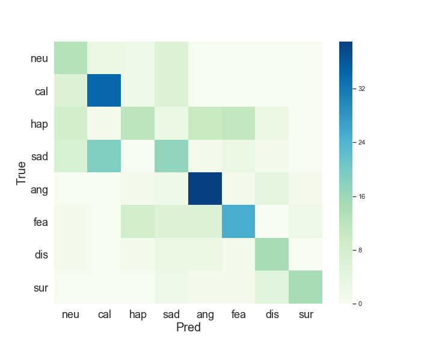

# Emotion-Classifier-Project
## Classify HOW the phrase is said (with which emotion)
---
## Some words about the dataset
I wanted to find an interesting, extraordinary and challenging problem to solve with sequential data, so I searched all over the Web and finally came upon an interesting dataset. It can be found and downloaded here: [RAVDESS](https://zenodo.org/record/1188976#.XGxny3q3qUl>)  
If you want, you can directly download [speech](https://zenodo.org/record/1188976/files/Audio_Speech_Actors_01-24.zip?download=1) and [song](https://zenodo.org/record/1188976/files/Audio_Song_Actors_01-24.zip?download=1) datasets.

### What is the dataset about?
It is a collection of two phrases which are said and sung by 24 different actors with 8 distinct emotions, two levels of intensity (normal, strong) and two repetitions of each.  

The *phrases* are:
- Kids are talking by the door
- Dogs are sitting by the door

*Emotion list* consists of:
- neutral (only normal intensity)
- calm
- happy
- sad
- angry
- fearful
- disgusted (only for speech)
- surprised  (only for speech)
---
## Audio preprocessing
As I found out, models for this dataset give best results when all audio files are centered and of the same length (but I also tried several other possibilities: padding with silence at the beggining, at the end, or just cutting off the silence). So, here are the things I've done to reach this:

1. *Cut off the silence*.  
It needs to be done in order to properly center audios afterwards.
2. *Find the maximum length of the cut audios*.  
I obviously need to know how much padding is required.
3. *Pad every audio with silense equally from both sides*.

The functions I used to do all that preprocessing can be found in `data/emotion_classifier/prepare_emotion_classifier.py` file.

### Data augmentation
I should also mention that *data augmentation* does not help with this problem at all, as ways to augment the dataset (e.g., pitch shifting and time stretching) make quality of an audio a little worse, but in order to recognize emotions correctly, the model actually needs high quality data.

---
## Feature extraction
As I have a relatively small dataset (2452 audio recordings), I need to find a way to primarily extract *meaningful features* from input audios. So, I decided to use pretrained audio embedding model. For this matter, [AudioSet](https://research.google.com/audioset///index.html) seemed to be a good fit. It's a dataset of 5.8 thousand hours of audio from YouTube. Luckily, Google researchers provided community with a model pretrained on AudioSet, which can extract useful embeddings. The model is called ***VGGish***, and, as the name suggests, it is a modification of *VGG* network. I'm going to use this model as it is, but if you want to learn more about it, check out this [GitHub repository](https://github.com/tensorflow/models/tree/master/research/audioset).

---
## Train/dev/test split
Now, let's discuss the way I split the dataset into training, development and testing parts.  
As you know, the dataset size is quite small, but still, I need dev and test sets to be *representative* of the whole dataset. That's why I chose audio recordings of 3 different actors for dev set, and the same for test set (312 audios each). This way, dev and test sets each comprise 12.5% of the whole dataset, and the rest 75% is reserved for training.

### A bit of good news...
I've actually done all required preprocessing beforehand, so in this project I work directly with precomputed embeddings. Train/dev/test split is also taken care of.  
So, in `data/emotion_classifier/train` folder you can find
- `train_filenames.npy`
- `train_embeddings.npy`
- `train_labels.npy`

The same is true for `dev` and `test` folders.

### But still...
In case you ever wanted to compute embeddings for your own audios, I provided a pipeline for this in `data/emotion_classifier/prepare_emotion_classifier.py` , and also computed an embedding for the example wavfile located here: `data/emotion_classifier/example/example.wav`

---
## Model structure
The best model I built turned out to be quite simple. Here is it's **structure**:

- Embeddings extracted from VGGish model
- Batch normalization
- Dropout
- Bidirectional GRU layer
- Dropout
- Batch normalization
- Dense layer

This model, trained for sufficient number of epochs, gives the following accuracy:

- *55.6%* on train set
- *51.5%* on dev set
- *51.4%* on test set

As you see, the model has **large variance**, so, in order to get better result, I need a much bigger dataset of real-person-speech audios. As I matter of fact, this model can overfit even much more without increasing accuracy on development set.

I also believe that **avoidable bias** problem is not very significant for this model, as I've tried a number of *more complex* models with various hyperparameter settings, such as:

- Multiple stacked RNN, GRU and LSTM layers
- Model with Attention mechanism

but none of those seemed to increase the model accuracy on development set. This is probably due to this problem having **high Bayes error**, especially for emotions expressed with *normal (not strong) intensity*. This issue will futher be discussed in *Error analysis* section.

---
## Error analysis
Let's look at the confusion matrix of the best model.

As you see, only the last two emotions (disgusted, surprised) are classified pretty good, while there is a lot of confusion among the rest of emotions. As an example of a pair of most frequently confused emotions, let's consider *sad* and *calm* emotions. If you were to listen to  

<audio controls="controls">
    <source type="audio/wav" src="data/emotion_classifier/example/calm_emotion_example.wav"></source>
</audio>

and  

<audio controls="controls">
    <source type="audio/wav" src="data/emotion_classifier/example/sad_emotion_example.wav"></source>
</audio>

would you be able to tell that the first one is calm and the second one is sad? Or is it vice versa?  
There are many such examples in this dataset, which makes me confident to state that the **Bayes error** for this problem is quite **high**.

---
## Final remark
If you want to learn more about the structure of the project and how to interact with it from shell, check out [DRU-DL-Project-Structure](https://github.com/dataroot/DRU-DL-Project-Structure) GitHub repository from *DataRoot University*.

